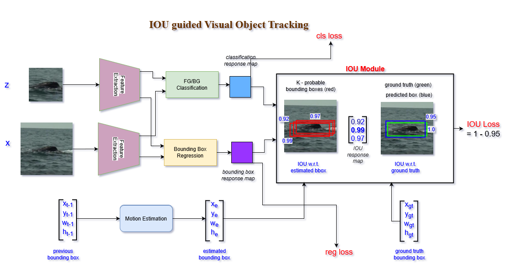

# IOU-SiamTrack
This method improve the performace of SiamRPN++ by maximizing the IOU.
It is presented at International Conference on Image Processing (ICIP)-2020.

Results on VOT2018
|-----------------------------------------------|
| Tracker       | Accuracy | Robustness |  EAO  |
|-----------------------------------------------|
| SiamRPN++     | 0.571    |  0.347     | 0.290 |
|-----------------------------------------------|
| IOU-SiamTrack | 0.565    |  0.309     | 0.327 |  
|-----------------------------------------------|
